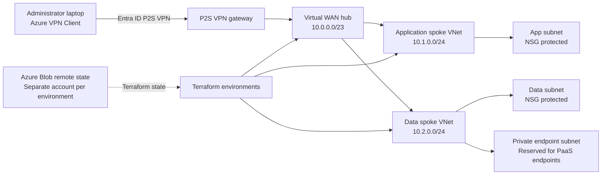

# Azure Virtual WAN Hybrid Cloud Architecture

A Terraform-managed Azure hub-and-spoke environment with Virtual WAN, Entra ID-authenticated point-to-site VPN, isolated environments, protected remote state, and documented validation procedures.

## Architecture Diagram



The repository also contains an architecture-diagram placeholder for a future Draw.io or PNG deliverable. The Mermaid diagram above reflects the currently implemented topology.

## Overview

This project demonstrates a reusable Azure infrastructure platform built with Terraform:

- Azure Virtual WAN and Virtual Hub for centralized connectivity
- Application and data spoke VNets with subnet-level NSG segmentation
- Entra ID-authenticated P2S VPN for administrator access
- Dedicated subnet reserved for future private endpoints
- Separate dev, test, and prod environments with isolated Terraform state
- Governance, managed identity, monitoring, and backup modules
- GitHub Actions validation and OIDC-based plan workflows
- Validation and troubleshooting documentation under `docs/`

The network, VPN control plane, environment isolation, Terraform validation, and plan workflows have been tested. A packet-level workload test remains pending an Azure-side target because the current subscription does not have a suitable VM SKU/quota available in East US.

## Repository Structure

```text
azure-hybrid-cloud-project/
├── .github/
│   └── workflows/
│       ├── terraform-demo.yml
│       ├── terraform-quality.yml
│       ├── terraform-plan.yml
│       └── terraform-apply.yml
├── demo/                         # Local-state, sanitized validation entry point
├── docs/
│   ├── troubleshooting.md
│   └── validation/
│       └── test.md
├── environments/
│   ├── dev/                      # Development root module and backend
│   ├── test/                     # Test root module and backend
│   └── prod/                     # Production root module and backend
├── modules/
│   ├── backup/                   # Recovery Services vault and VM policy
│   ├── governance/               # Audit-only environment tag policy
│   ├── identity/                 # User-assigned managed identity
│   ├── monitoring/               # Log Analytics workspace
│   └── network/                  # Virtual WAN, hub, spokes, VPN, and NSGs
├── scripts/
│   └── Bootstrap-Backend.ps1     # Creates Azure Terraform state storage
├── .gitignore
└── README.md
```

## Prerequisites

- Azure subscription with permission to create the listed resources
- PowerShell 7+ (`pwsh`)
- Terraform CLI 1.7 or later
- Azure PowerShell `Az` module for backend bootstrap:
  `Install-Module -Name Az -Scope CurrentUser -Repository PSGallery -Force`
- Azure CLI for Entra-authenticated local Terraform state access
- Microsoft Entra ID account
- Azure VPN Client for P2S testing on Windows

## Environment and State Design

Each environment uses a separate Azure Storage account, resource group, container, and state key. This prevents state overlap and creates an independent recovery boundary:

| Environment | Backend resource group | Storage account | Container | State key |
|---|---|---|---|---|
| dev | `rg-tfstate-dev01ahcps` | `sttfstatedev01ahcps` | `tfstate` | `dev.terraform.tfstate` |
| test | `rg-tfstate-test01ahcps` | `sttfstatetest01ahcps` | `tfstate` | `test.terraform.tfstate` |
| prod | `rg-tfstate-prod03ahcps` | `sttfstateprod03ahcps` | `tfstate` | `prod.terraform.tfstate` |

The `ahcps` suffix makes the storage account names globally unique while preserving the environment identifiers `dev01`, `test01`, and `prod03`. Separate storage accounts were chosen because they provide a clearer security and recovery boundary than sharing one account for every environment.

## Backend Protection

All three Terraform state storage accounts use Azure Blob Storage with:

- HTTPS-only access and TLS 1.2
- Blob public access disabled
- Blob versioning enabled
- Blob soft delete enabled for 30 days
- Container soft delete enabled for 30 days
- Change feed enabled
- A dedicated `tfstate` container

The AzureRM backend provides state locking through Azure Blob leases. The separate state keys and locking prevent concurrent Terraform operations from corrupting state. State files must never be edited manually or committed to Git.

## Deployment

Authenticate to Azure in PowerShell:

```powershell
Connect-AzAccount
az login
```

Create backend storage when setting up a new environment:

```powershell
.\scripts\Bootstrap-Backend.ps1 -Suffix <suffix>
```

Deploy one environment at a time. Start with `dev`, then promote through `test` and `prod` after reviewing each plan:

```powershell
Set-Location .\environments\dev
Copy-Item terraform.tfvars.example terraform.tfvars
terraform init -reconfigure
terraform validate
terraform plan
terraform apply
```

Use the matching environment directory and backend for `test` or `prod`. Never run an apply from the wrong environment directory, and never commit `terraform.tfvars`, state files, credentials, or storage keys.

## Testing

### Terraform Checks

The repository has passed formatting, initialization, validation, and plan checks for the real environments. The local commands are:

```powershell
terraform fmt -check -recursive
terraform init -input=false -reconfigure
terraform validate
terraform plan -input=false -lock-timeout=5m
```

### P2S Control-Plane Validation

The test environment P2S control plane was validated with Azure VPN Client:

- Entra ID authentication succeeded
- The VPN gateway was reachable and attached
- The laptop received VPN address `172.16.0.130`
- Routes for the hub, app spoke, data spoke, and VPN pool were received
- Azure VPN Client reached `Connected`
- Azure Portal reported the active P2S session when refreshed promptly

See [docs/validation/test.md](docs/validation/test.md) for the recorded evidence and procedure.

### End-to-End Traffic Validation

End-to-end packet flow requires an Azure-side private target, such as a VM or private endpoint. The temporary VM attempt was removed after East US capacity, SKU availability, and quota restrictions prevented deployment. The P2S control-plane result is confirmed; workload traffic validation is documented as future work.

## CI/CD

GitHub Actions provides:

- Pull request and main-branch quality checks with `terraform fmt -check`,
  backend-free validation, TFLint, and advisory Checkov scanning
- Manual environment plans for dev, test, and prod using OIDC
- Saved binary Terraform plan artifacts with seven-day retention
- Plan text written to the GitHub Actions job summary
- Apply checks out and verifies the exact source commit recorded with the plan
- Concurrency groups that cancel superseded plans and prevent overlapping applies
- Manual environment selection for dev, test, and prod
- An apply workflow that downloads and applies the exact saved plan artifact
- Entra federation restricted to the repository's main branch
- Separate state access through `Storage Blob Data Contributor`

Manual apply confirmation is implemented through the required `APPLY` or `CANCEL`
workflow input. GitHub-enforced required reviewers are unavailable on the current plan
for this private repository. The apply workflow should be run only with the environment,
plan run ID, and exact source commit that were reviewed. It verifies the commit recorded
in the plan artifact before applying and never generates a new plan during apply.

Approval-gated production apply remains pending a GitHub plan upgrade or a repository
configuration that supports environment-level required reviewers.

## Troubleshooting

See [docs/troubleshooting.md](docs/troubleshooting.md) for Azure VPN Client diagnostics, P2S session checks, quota failures, and the future end-to-end traffic test procedure.

## Future Enhancements

- Add a supported private workload target for packet-level VPN validation
- Add private endpoint resources and private DNS integration
- Restrict backend network access after all required identities are known
- Enable GitHub-enforced approval gates for production apply after the repository plan
  or visibility supports required reviewers
- Add diagnostic settings and alert rules to the monitoring module
- Add VM backup association when a protected VM exists
- Add CAF and Well-Architected Framework mapping
- Add a finalized Draw.io architecture diagram
